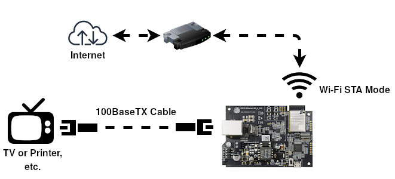

| Supported Targets | ESP32 | ESP32-S2 | ESP32-C3 |
| ----------------- | ----- | -------- | -------- |

# eth2sta Example
(See the README.md file in the upper level IDF 'examples' directory for more information about examples. To try a more complex application about Ethernet to WiFi data forwarding, please go to [iot-solution](https://github.com/espressif/esp-iot-solution/tree/release/v1.1/examples/eth2wifi).)

**Note:** This example uses some internal APIs (e.g. `esp_wifi_internal_tx`) which might get changed between minor versions of ESP-IDF.

## Overview


The similarities on MAC layer between Ethernet and Wi-Fi make it easy to forward packets from Ethernet to Wi-Fi and vice versa. This example illustrates how to implement a simple "router" which only supports forwarding packets between Ethernet port and Wi-Fi station interface and vice versa. In this case, the WiFi should play the role of WAN (i.e. it can access outside network) so that a device could get access to the Internet when it gets connected to ESP32 through Ethernet.

This is explained in detail at the following website.
[ESP32 application practice: ethernet to WiFi implementation](https://blog.actorsfit.com/a?ID=00600-f2eba9d2-7973-4a57-8fd2-ae8dd0e7a066)

**Note:** In this example, ESP32 works like a *bridge* between Ethernet and Wi-Fi, and it won't perform any actions on Layer3 and higher layer, which means there's no need to initialize the TCP/IP stack.

## How to use example

### Hardware Required

To run this example, it's recommended that you have an official ESP32 Ethernet development board - [ESP32-Ethernet-Kit](https://docs.espressif.com/projects/esp-idf/en/latest/hw-reference/get-started-ethernet-kit.html). This example should also work for 3rd party ESP32 board as long as it's integrated with a supported Ethernet PHY chip. Up until now, ESP-IDF supports up to four Ethernet PHY: `LAN8720`, `IP101`, `DP83848` and `RTL8201`, additional PHY drivers should be implemented by users themselves.

Besides that, `esp_eth` component can drive third-party Ethernet module which integrates MAC and PHY and provides common communication interface (e.g. SPI, USB, etc). This example will take the **DM9051** as an example, illustrating how to install the Ethernet driver in the same manner.

#### Pin Assignment

See common pin assignments for Ethernet examples from [upper level](https://github.com/espressif/esp-idf/tree/release/v4.4/examples/README.md#common-pin-assignments).

### Configure the project

```
idf.py menuconfig
```

In addition to the common configurations for Ethernet examples from [upper level](https://github.com/espressif/esp-idf/tree/release/v4.4/examples/README.md#common-pin-assignments), you might also need to update the default value of following configurations:

In the `Example Configuration` menu:
* Set the SSID and password for the remote Wi-Fi AP under `Wi-Fi SSID` and `Wi-Fi Password`.

### Build, Flash, and Run

Build the project and flash it to the board, then run monitor tool to view serial output:

```
idf.py -p PORT build flash monitor
```

(Replace PORT with the name of the serial port to use.)

(To exit the serial monitor, type ``Ctrl-]``.)

See the [Getting Started Guide](https://docs.espressif.com/projects/esp-idf/en/latest/get-started/index.html) for full steps to configure and use ESP-IDF to build projects.

## Example Output

### Step 1: Initialize Ethernet and Wi-Fi (STA mode)

```bash
I (590) wifi:wifi driver task: 3ffbe840, prio:23, stack:6656, core=0
I (590) system_api: Base MAC address is not set
I (590) system_api: read default base MAC address from EFUSE
I (620) wifi:wifi firmware version: 63017e0
I (620) wifi:wifi certification version: v7.0
I (620) wifi:config NVS flash: enabled
I (620) wifi:config nano formating: disabled
I (630) wifi:Init data frame dynamic rx buffer num: 32
I (630) wifi:Init management frame dynamic rx buffer num: 32
I (640) wifi:Init management short buffer num: 32
I (640) wifi:Init dynamic tx buffer num: 32
I (650) wifi:Init static rx buffer size: 1600
I (650) wifi:Init static rx buffer num: 10
I (650) wifi:Init dynamic rx buffer num: 32
I (660) wifi_init: rx ba win: 6
I (660) wifi_init: tcpip mbox: 32
I (670) wifi_init: udp mbox: 6
I (670) wifi_init: tcp mbox: 6
I (670) wifi_init: tcp tx win: 5744
I (680) wifi_init: tcp rx win: 5744
I (680) wifi_init: tcp mss: 1440
I (690) wifi_init: WiFi IRAM OP enabled
I (690) wifi_init: WiFi RX IRAM OP enabled
I (2330) eth2sta: Ethernet Started
```

### Step 2: Device/PC/TV/Printer Connects to Ethernet on ESP32

```bash
I (2330) eth2sta: Ethernet Link Up
```

### Step 3: ESP32's Wi-Fi Station Connects to Upstream Wi-Fi AP

```bash
I (8040) phy_init: phy_version 4670,719f9f6,Feb 18 2021,17:07:07
I (8130) wifi:mode : sta (81:7d:3a:81:8b:0c)
I (8130) wifi:enable tsf
I (8140) wifi:enable tsf
I (8140) eth2sta: WiFi Started
I (8150) wifi:new:<6,0>, old:<1,0>, ap:<255,255>, sta:<6,0>, prof:1
I (8160) wifi:state: init -> auth (b0)
E (8160) wifi:sta is connecting, return error
I (8170) wifi:state: auth -> assoc (0)
I (8170) wifi:state: assoc -> run (10)
I (8190) wifi:connected with internet, aid = 1, channel 6, BW20, bssid = 17:cc:20:47:ab:4a
I (8200) wifi:security: WPA2-PSK, phy: bgn, rssi: -61
I (8200) wifi:pm start, type: 1
I (8200) eth2sta: WiFi Link Up
I (8230) wifi:AP's beacon interval = 102400 us, DTIM period = 2
W (50630) wifi:<ba-add>idx:0 (ifx:0, 17:cc:20:47:ab:4a), tid:3, ssn:0, winSize:64
W (55850) wifi:<ba-add>idx:1 (ifx:0, 17:cc:20:47:ab:4a), tid:0, ssn:0, winSize:64
```

Now your Ethernet connected device should get access to the Internet.

## Troubleshooting

See common troubleshooting for Ethernet examples from [upper level](https://github.com/espressif/esp-idf/tree/release/v4.4/examples/README.md#common-troubleshooting).

* If you got error message like `WiFi send packet failed` when running the example, you may need to enlarge the value of `FLOW_CONTROL_WIFI_SEND_DELAY_MS` in "eth2sta_main.c", because Ethernet process packets faster than Wi-Fi on ESP32.
* If you got error message like `send flow control message failed or timeout` when running the example, you may need to enlarge the value of `FLOW_CONTROL_QUEUE_LENGTH` in "eth2sta_main".
* Wi-Fi station doesn't receive any IP via DHCP?
    * All Layer 3 (TCP/IP functions) on the ESP32 are disabled, including a DHCP server. This means that devices must be able to access another DHCP server (for example on the Wi-Fi router) or should use statically assigned IP addresses.
